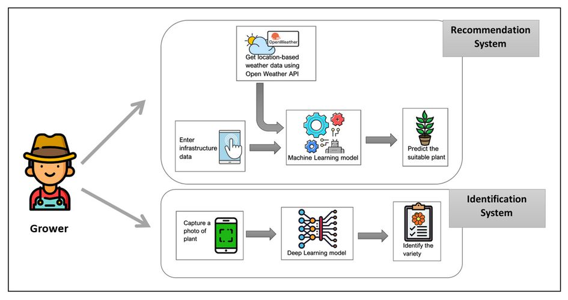
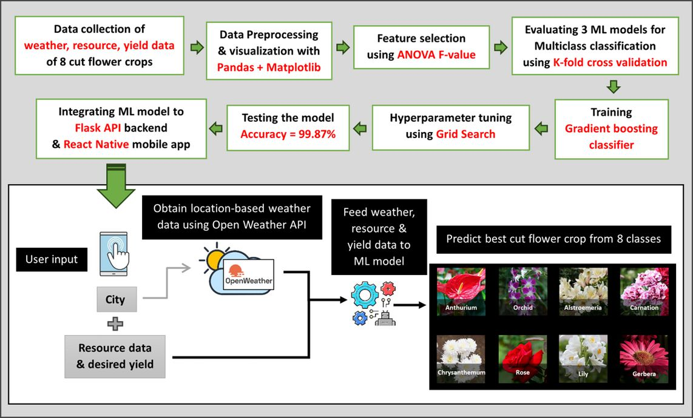
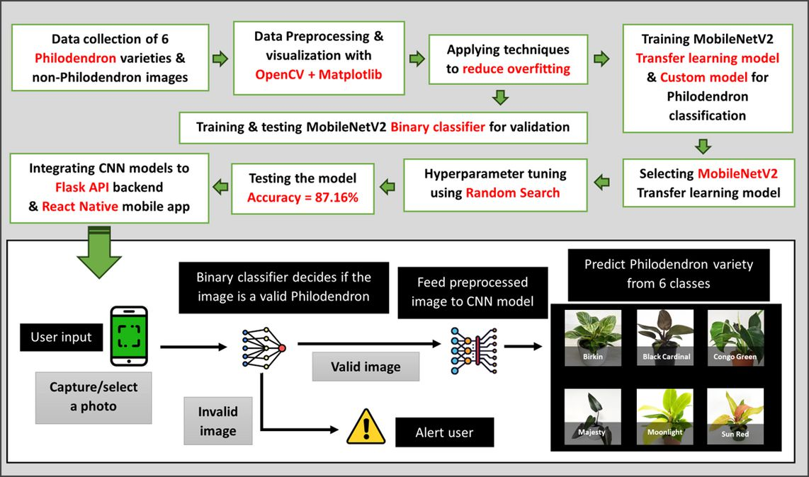
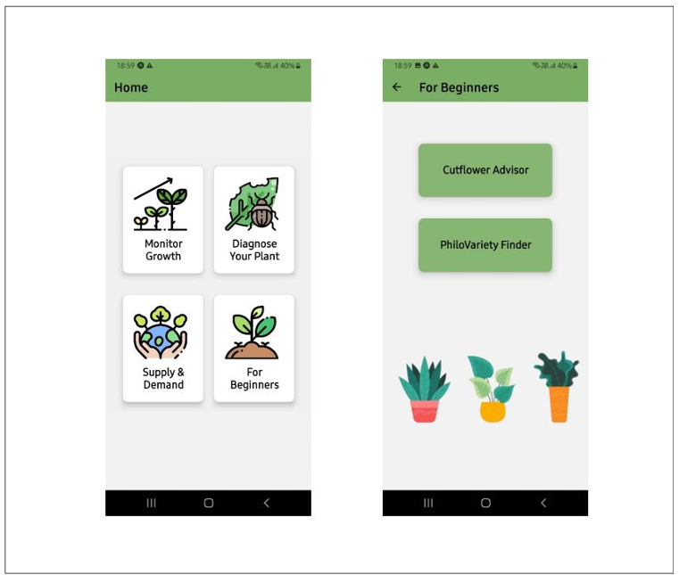
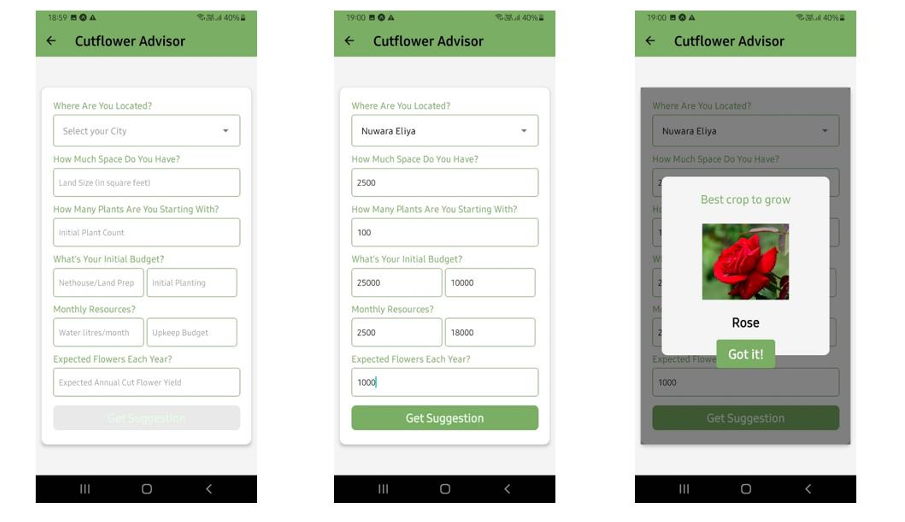
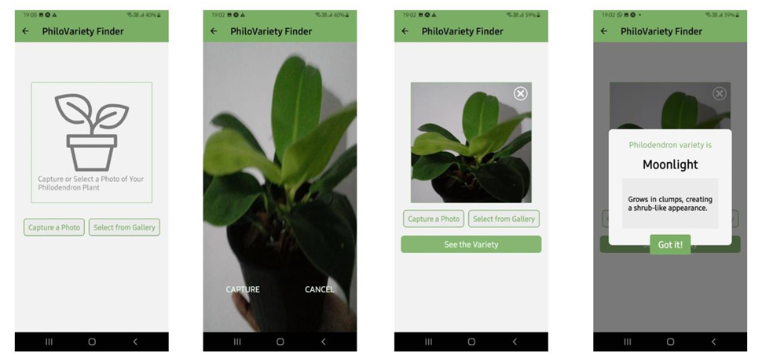
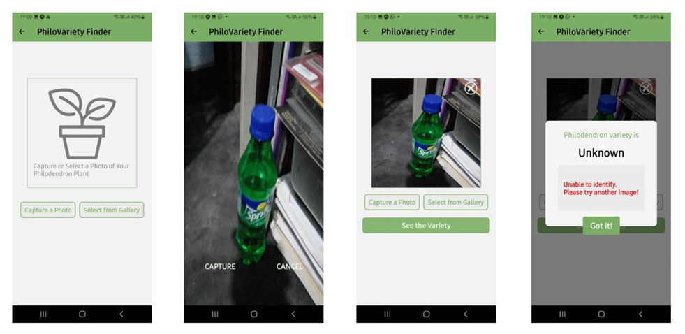

# PlantPal_"For Beginners"
A cross-platform mobile application developed as part of a final year research project, aimed at assisting beginners in Sri Lankan floriculture with **cut flower crop selection** and **Philodendron variety identification** using affordable technologies.
 
https://github.com/user-attachments/assets/16c9aa0c-5dc0-4212-a990-f888c8985989
 
## Research Problem

Cut flowers and ornemantal plants are key products in Sri Lanka's floriculture industry, but beginner growers often struggle with:
- Selecting suitable crops based on **weather, resources, and expected yield**
- Identifying different **Philodendron varieties** used in tissue culture and foliage décor

❌ Poor decisions result in time, money, and resource losses  
❌ Lack of expert guidance for new growers  
✅ This app bridges this gap with **accessible technology**

## Overall Architecture

### 1️⃣ Cutflower Advisor  
- Machine learning–based model  
- Crop recommendation based on weather (via OpenWeather API)  
- Factors considered: temperature, humidity, infrastructure

### 2️⃣ Philovariety Finder  
- Image classification model to identify Philodendron varieties  
- Built using CNNs and trained on a custom dataset
- Out-of-scope image detection using DL

## Project Snapshots

 

 

 

## Tech Stack

- **React Native** – Cross-platform mobile development  
- **Python + Flask** – Backend + model hosting  
- **Python, Scikit-learn, TensorFlow, Keras** – ML & DL components  
- **OpenWeather API** – Weather data integration  

## 🔐 Access Note

Some implementation components (ML models, datasets, and backend logic) remain unpublished and are not included in this repository. For inquiries, please contact:

📧 **[dgamage102@gmail.com]**

